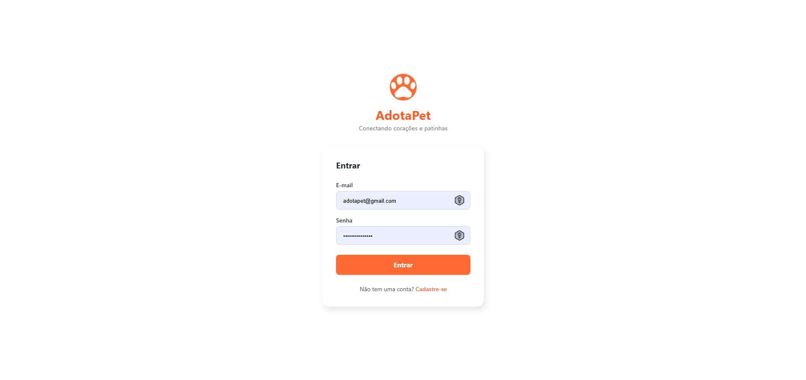
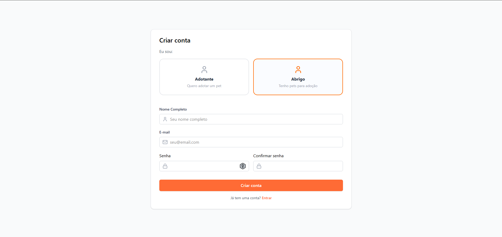
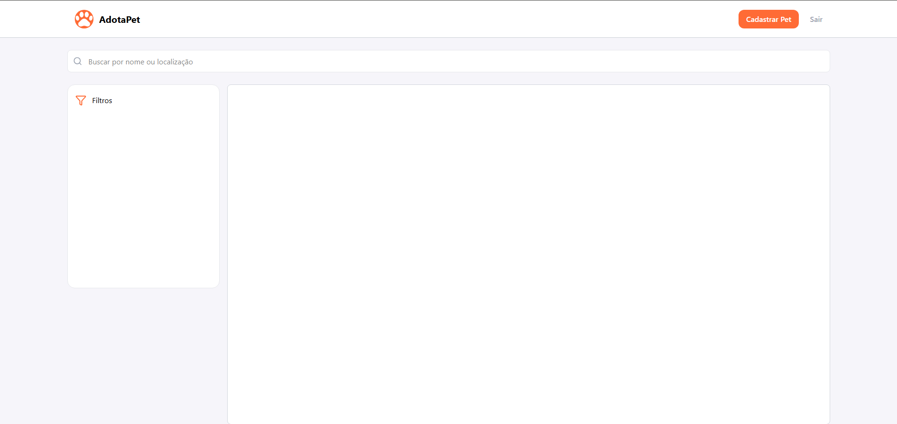

# AdotaPet - Conectando corações e patinhas 🐾

O **AdotaPet** é uma plataforma dedicada a facilitar o processo de adoção de animais de estimação, conectando abrigos e protetores a pessoas interessadas em dar um novo lar a um pet. 

OBS: Este projeto é facultativo e não será integrado para produção.

## 🚀 Status do Projeto

Este projeto está em desenvolvimento inicial. Atualmente, a interface base do frontend foi estruturada, incluindo o fluxo de autenticação e a visualização principal.

## 🛠 Tecnologias Utilizadas

- **Frontend:**
  - [React 19](https://react.dev/)
  - [Vite](https://vitejs.dev/)
  - [Tailwind CSS](https://tailwindcss.com/)
  - [Lucide React](https://lucide.dev/) (Ícones)
  - [React Router Dom](https://reactrouter.com/) (Navegação)
- **Backend (Em estruturação):**
  - Node.js
- **Linguagem:** TypeScript (Frontend) / Node.js (Backend)

## 📂 Funcionalidades Desenvolvidas

### Frontend
- **Página de Login:** Interface intuitiva para acesso de usuários cadastrados.
- **Página de Cadastro:** Fluxo para novos usuários escolherem entre perfil de "Adotante" ou "Abrigo", com validações de formulário.
- **Página Home:** Dashboard inicial com:
  - Barra de navegação responsiva.
  - Barra de busca para localização de pets.
  - Filtros laterais (em desenvolvimento).
  - Área de exibição de conteúdo.

## 📸 Demonstração
- [EM DESENVOLVIMENTO]

> **Página de Login**
> 

> **Página de Cadastro**
> 

> **Página Home**
> 

---

Desenvolvido como projeto semestral.
